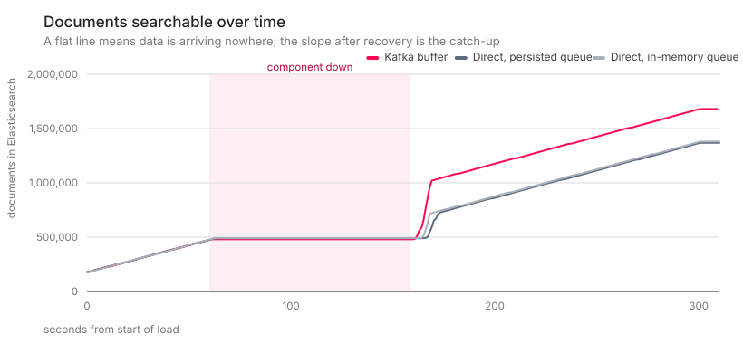
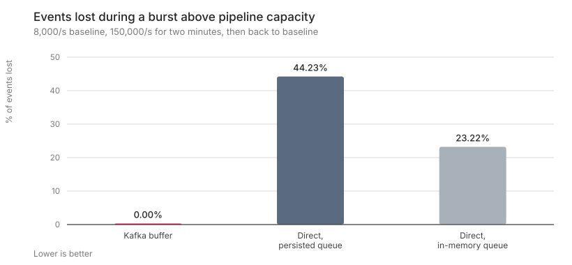
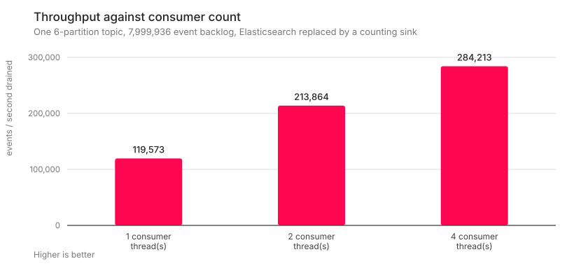

# Does a Kafka buffer earn its place in a log pipeline?

Log platform designs routinely put a broker between the collection agents and
Logstash/Elasticsearch, and the reasons given are usually asserted rather than
measured: *resilience*, *decoupling*, *no data loss*. Those are testable claims.
So is the obvious objection to them — that the broker is extra infrastructure
solving a problem a local queue already solves.

This repository runs three ingestion architectures through the same load and the
same failures, counts exactly what each one loses, and publishes the code that
produces every number.

**The short version:** a persisted local queue is genuinely good — it matched
Kafka exactly when Elasticsearch went down. The difference appears when the
*collector itself* is unavailable, because a queue on a node that is not running
accepts nothing.

---

## The three architectures

| Arm | Path | Where events wait when something breaks |
|---|---|---|
| `kafka` | generator → **Kafka** → Logstash → Elasticsearch | In the topic, replicated across brokers |
| `direct-pq` | generator → Logstash (`queue.type: persisted`) → Elasticsearch | On the Logstash node's disk |
| `direct-mem` | generator → Logstash (default in-memory queue) → Elasticsearch | In Logstash's memory, briefly |

`direct-pq` is included deliberately. Benchmarking a broker only against an
unbuffered default would be a rigged fight, and the persisted queue is the
configuration a reviewer will reasonably propose instead.

All three share one Elasticsearch, one filter block, one output configuration
and one load generator. The only variable is the transport.

---

## Results

Full detail, with charts, is in [`docs/report/index.html`](docs/report/index.html);
every figure traces back to a `run.json` under [`results/`](results/).

### Data loss

| Scenario | `kafka` | `direct-pq` | `direct-mem` |
|---|---|---|---|
| **Elasticsearch down 139 s** | **0** lost | **0** lost | 750,364 lost (50.0%) |
| **Collector restarted 99-104 s** | **0** lost | 311,830 lost (20.8%) | 300,294 lost (20.0%) |
| One of three Kafka brokers killed | **0** lost, 8 s producer stall | n/a | n/a |

1,500,000 events per run at 5,000 events/s, identical 200,000-event source
buffer on every arm.



The flat stretch is the outage. What matters is where each line ends: the Kafka
arm climbs steeply afterwards and catches up completely, while the two direct
arms resume from where they left off — the events that arrived while the
collector was down are simply gone.

This is the heart of it. When the *sink* fails, the persisted queue is as good as
a broker — it absorbed the entire outage without losing an event. When the
*collector* is taken down for a routine restart, the persisted queue is no help
at all: it lives on the node that is not running, so the sources have nowhere to
send and their buffers overflow. Only a buffer placed *upstream* of the collector
covers both cases.

Notably, in every run the missing events were dropped at the source because its
buffer filled. No arm lost data it had already accepted — a meaningfully
different and worse failure that did not occur here.

### A burst above capacity

Nothing is broken here. Everything is healthy; there is simply more data arriving
for 40 seconds than the pipeline can index — 150,000 events/s against a measured
ceiling of roughly 99,000/s. An incident, a debug level left on, a batch job.

| Arm | Lost | Peak backlog | p99 latency during burst | Caught up after |
|---|---|---|---|---|
| `kafka` | **0** | 2,061,595 events queued | 21,986 ms | 153 s |
| `direct-mem` | 1,644,121 (23.2%) | — | 2,429 ms | — |
| `direct-pq` | 3,131,529 (44.2%) | — | 3,667 ms | — |

7,080,000 events per run.



The buffer does not make the burst disappear — it converts it into a **bounded,
visible delay**. Two million events sat in the topic, the worst event was 22
seconds late, and everything was caught up 153 seconds later. The direct arms
have lower latency figures only because the events that would have been slow were
dropped instead of delivered.

`direct-pq` fares worst here, which follows from its lower throughput ceiling:
writing every event to disk before acknowledging costs the headroom it needs
precisely when a burst arrives.

### What the buffer costs

| Arm | p50 | p95 | p99 | Time to searchable (median) |
|---|---|---|---|---|
| `kafka` | 100 ms | 191 ms | 212 ms | 770 ms |
| `direct-mem` | 99 ms | 187 ms | 201 ms | 886 ms |
| `direct-pq` | 18 ms | 29 ms | 33 ms | 837 ms |

At 5,000 events/s with queues empty, the Kafka hop costs about **1 ms at the
median** and roughly 11 ms at p99 against the in-memory arm. That is the honest
price of the extra hop, and it is small.

Two things worth noting. The persisted-queue arm is *faster* here, not slower.
And time-to-searchable is dominated by Elasticsearch's 1-second refresh interval
in all three arms — which means end-to-end latency claims measured in
milliseconds are measuring the wrong thing.

### Throughput

| Arm | Sustained indexing rate |
|---|---|
| `kafka` | 99,620 events/s |
| `direct-mem` | 98,588 events/s |
| `direct-pq` | 68,519 events/s |

Kafka costs nothing in throughput. The persisted queue costs about **30%**, which
is the price of writing every event to disk before acknowledging it.

Scaling consumers over a six-partition topic, draining a fixed 7,999,936-event
backlog:

| Consumer threads | Throughput | Speed-up |
|---|---|---|
| 1 | 119,573 events/s | 1.00× |
| 2 | 213,864 events/s | 1.79× |
| 4 | 284,213 events/s | 2.38× |



Near-linear from one to two consumers, clearly sub-linear by four. "Add
partitions and consumers" works, but it is not free scaling, and saying so is
more useful than claiming otherwise.

### Deduplication of at-least-once sources

20% of events deliberately sent twice, as an Event Hub reader or a retrying agent
does. Kafka's idempotent producer removes duplicates created by its *own*
retries, but not a duplicate the source genuinely sent — to Kafka those are two
different produce calls carrying identical content. A content fingerprint used as
the document `_id` removes them.

| Mode | Events sent | Documents stored | Duplicates | Index size |
|---|---|---|---|---|
| auto-generated `_id` | 539,642 | 539,642 | 89,642 | 150.4 MB |
| fingerprint `_id` | 539,642 | **450,000** | **0** | 153.5 MB |

The deduplication works exactly — every one of the 89,642 duplicates is gone. The
storage result is the interesting part: the index is **2% larger**, not smaller.
Elasticsearch's auto-generated ids are optimised for compact storage, and an
explicit 32-character fingerprint costs enough to cancel out 17% fewer documents
at this duplication rate. Deduplicate for correctness — counts, alerts and audit
queries — not for the storage bill.

### Compression

Producing the same events to Kafka under each codec with the producer running
flat out, reading the topic size back from the brokers' own log directories:

| Codec | Bytes per event | vs uncompressed | Producer throughput |
|---|---|---|---|
| none | 617 B | — | 241,498/s |
| lz4 | 129 B | 4.8× | 245,361/s |
| gzip | 67 B | 9.2× | 224,490/s |
| zstd | **45 B** | **13.8×** | **246,056/s** |

Ratios are against the measured `none` run, so Kafka's own record framing is on
both sides of the comparison.

zstd is the clear pick here: the smallest bytes *and* the highest throughput,
while gzip pays about 7% throughput for a worse ratio.

At rest, the same documents under Elasticsearch's `best_compression` instead of
the default codec: **286 B/doc → 163 B/doc, 42.9% smaller** (both force-merged to
a single segment first, so segment count does not distort the comparison).

> These ratios are an upper bound. The generator's filler text is drawn from a
> small vocabulary and compresses better than real log data will. Treat the
> *ordering* of the codecs as the transferable result, not the multiples.

---

## How loss is counted

Nothing here rests on sampling or estimation.

Every event carries `gen_id` and a strictly increasing per-generator `seq`, so
the set of events that *should* be in Elasticsearch is known exactly.
[`bench/verify.py`](bench/verify.py) walks the entire index with a point-in-time
cursor and marks a bitset, which yields the exact count of missing and duplicated
events and the position of the first gap — not a cardinality approximation.

That accounting is itself tested.
[`bench/selftest_accounting.py`](bench/selftest_accounting.py) indexes a
synthetic run with a known number of deliberately omitted and repeated events and
asserts the verifier reports exactly those numbers. A loss figure from untested
accounting code is not worth reading.

Two further points of method:

- **Losses are attributed.** Events dropped because the source's buffer filled
  are reported separately from events the pipeline accepted and never delivered.
  They are different failures.
- **The source cannot block forever.** Real sources — syslog, Windows agents, an
  Event Hub reader — keep receiving whether or not anyone downstream is ready. So
  the generator models a bounded buffer that drops when full, with the *same*
  bound on every arm. A generator that simply slowed down when the pipeline
  stalled would hide loss instead of measuring it.

Latency is `ingest_ts - emit_ts`, where `ingest_ts` is stamped by an
Elasticsearch ingest pipeline, so no client clock is involved on the receiving
side. Both containers share the Docker host clock. Percentiles are read off a
1 ms-resolution histogram over the full population, which at millisecond source
precision is exact rather than interpolated.

Every scenario burns a warm-up pass first: JRuby reaches steady state slowly, and
measuring a cold Logstash publishes JIT warm-up as pipeline latency. Warm-up
events use an offset generator id so the verifier can tell them apart.

---

## Reproducing it

Requires Docker (16 GB memory recommended) and Python 3. Nothing else: the
generator, verifier and report renderer all run in a container.

```bash
cp .env.example .env
make up          # start Kafka + Elasticsearch, install template and topic
make smoke       # ~3 min: all three arms, end to end, should lose nothing
make bench-all   # ~2 h: the full suite, then rebuilds docs/report/
```

Individual scenarios, and single arms within them:

```bash
python3 scenarios/01_sink_outage.py --arm kafka
python3 scenarios/03_latency.py
make report      # rebuild docs/report/ from results/ alone
```

`make down` removes the containers and volumes.

### Layout

```
stack/      Elasticsearch template and ingest pipeline, Logstash configs
bench/      generator, verifier, probe, counting sink, report renderer
scenarios/  one script per scenario, run from the host
results/    one run.json per scenario and arm — the raw evidence
docs/report/ generated HTML and SVG charts, served by GitHub Pages
```

The Logstash filter and Elasticsearch output are mounted into all three arms from
the same files, so "identical processing" is visible in the compose file rather
than merely asserted.

---

## A tuning note

`pipeline.batch.size` dominates latency far more than the transport does. On this
rig, at an identical 5,000 events/s through the identical pipeline:

| `pipeline.batch.size` | p50 | p99 |
|---|---|---|
| 125 | 97 ms | 208 ms |
| 1000 | 774 ms | 1,563 ms |

The benchmark uses 125 throughout. Anyone comparing pipeline latencies should
check this setting before attributing a difference to the architecture.

---

## What this does not prove

- **The absolute rates are this rig's, not a platform's.** Everything runs on one
  laptop-class Docker host (18 CPUs, 23 GB). The comparison between arms
  transfers; the events-per-second numbers do not.
- **Elasticsearch here is a local single node**, not a managed multi-zone
  service. Real availability zones, managed failover and object-storage-backed
  tiers are not exercised.
- **The events are synthetic.** Realistic in size and shape, but not a real log
  mix — which matters most for the compression ratios above.
- **The source buffer is a model**, not a specific agent's implementation. What
  matters for the comparison is that the same bound applies to every arm.
- **The failure list is not exhaustive.** Network partitions, disk-full on the
  broker, slow consumers and corrupted data are all absent.
- **Persisted-queue throughput is disk-bound here.** Container filesystem sync on
  a developer machine is slower than a provisioned server's, which counts against
  `direct-pq` in the throughput measurement specifically.
- **Outage windows are not identical between arms.** Recovery is declared after a
  polled readiness check, so the measured windows differ by a few seconds
  (98.7 s, 101.8 s and 103.9 s in the collector scenario). Loss scales with how
  long the outage lasted, so the gap between `direct-pq` and `direct-mem` there is
  within what the longer window alone explains — it is not an architectural
  ranking. The finding that separates them from `kafka` is not affected.
- **Attribution of loss is approximate at the margin.** A batch the collector
  processed but whose HTTP response timed out is retried by the source and can be
  counted as dropped although it was indexed. Totals are exact; the split between
  "dropped at source" and "lost after acceptance" can be off by single-digit
  events per million.

---

## Claim-to-evidence map

| Claim commonly made for a broker | Tested by | Verdict on this rig |
|---|---|---|
| Protects against sink outages | `01_sink_outage.py` | Yes — but a persisted queue does too |
| Protects against collector outages and maintenance | `01c_collector_outage.py` | Yes, and only the broker does |
| Absorbs bursts above capacity | `02_burst.py` | Yes — 0 lost vs 23–44%, as bounded delay |
| Costs little latency | `03_latency.py` | Yes — about 1 ms at p50 |
| Scales by adding partitions and consumers | `04_scale_out.py` | Yes, near-linear to 2×, sub-linear by 4× |
| Survives losing a broker | `01b_broker_failure.py` | Yes — 0 lost, 8 s producer stall |
| Enables deduplication of at-least-once sources | `05_dedup.py` | Yes for correctness; no storage saving |
| Compression reduces buffered and stored bytes | `06_compression.py` | Yes — 13.8× in transit, 43% at rest |

---

## License

Apache-2.0 — see [LICENSE](LICENSE).

The mimacom logo in `docs/report/assets/logo.svg` is a trademark and is not covered
by that licence; see [NOTICE](NOTICE).
